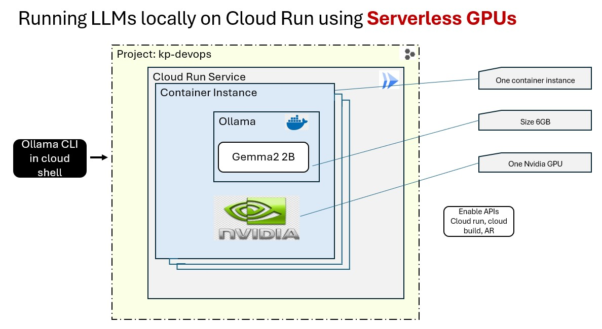

## Step 0: Pre-requisites 

Submit your project details to Google to get GPU quota ( ETA: 1 day) for Approval 
[Cloud Run GPU sign up](https://services.google.com/fb/forms/cloudrungpusignup/)


## Step 1: Enable APIs, set variables: project and region, Roles

```bash
##Enable the Google APIs: cloud run, cloud build and artifact registry

gcloud services enable \
    run.googleapis.com \
    cloudbuild.googleapis.com \
    artifactregistry.googleapis.com
```


## Step 2: Assign required IAM Roles 
We are using OWNER perms to keep it simple 

Check out [Google Documentation](https://cloud.google.com/run/docs/tutorials/gpu-gemma2-with-ollama?utm_source=youtube&utm_medium=unpaidsoc&utm_campaign=CDR_efrainpedroza_gemma2_iy-z00bfnoc_ServerlessExpeditions_092724&utm_content=description) for fine grained IAM Roles


## Step 3: Set Environment Variables project id region etc 

```bash
export PROJECT_ID=kp-devops
export PROJECT=kp-devops
export LOCATION us-central1
export REGION us-central1
export REPOSITORY=ollama-repo
export OLLAMA_IDENTITY=ollama-sa
export SERVICE=ollama-gemma

gcloud config set project $PROJECT
gcloud config set run/region $REGION

```

## Step 4: Create Artifact Registry Docker Repository 

```bash
gcloud artifacts repositories create $REPOSITORY \
  --repository-format=docker \
  --location=us-central1

```

## Step 5: Build container image  

```bash
gcloud builds submit \
   --tag us-central1-docker.pkg.dev/$PROJECT_ID/$REPOSITORY/ollama-gemma \
   --machine-type e2-highcpu-32

```

## Step 6: Create a service account for our cloud run service 

```bash
gcloud iam service-accounts create $OLLAMA_IDENTITY \
  --display-name="Service Account for Ollama Cloud Run service"

```


## Step 7: Deploy image to Cloud Run  

```bash
gcloud beta run deploy ollama-gemma \
  --image us-central1-docker.pkg.dev/$PROJECT_ID/$REPOSITORY/ollama-gemma \
  --concurrency 4 \
  --cpu 8 \
  --set-env-vars OLLAMA_NUM_PARALLEL=4 \
  <strong>--gpu 1 \
  --gpu-type nvidia-l4</strong> \
  --max-instances 7 \
  --memory 32Gi \
  --allow-unauthenticated \
  --no-cpu-throttling \
  --service-account $OLLAMA_IDENTITY@$PROJECT_ID.iam.gserviceaccount.com \
  --timeout=600

  
```


> **Note:** Pay special attention to the GPU configuration (`--gpu 1` and `--gpu-type nvidia-l4`) in the following command.

```bash
gcloud beta run deploy ollama-gemma \
  --image us-central1-docker.pkg.dev/$PROJECT_ID/$REPOSITORY/ollama-gemma \
  --concurrency 4 \
  --cpu 8 \
  --set-env-vars OLLAMA_NUM_PARALLEL=4 \
  --gpu 1 \
  --gpu-type nvidia-l4 \
  --max-instances 7 \
  --memory 32Gi \
  --allow-unauthenticated \
  --no-cpu-throttling \
  --service-account $OLLAMA_IDENTITY@$PROJECT_ID.iam.gserviceaccount.com \
  --timeout=600


## Step 8: Invoke the Local Gemma Cloud Run Service with GPU 
```bash

gcloud run services proxy ollama-gemma --port=9090

curl http://localhost:9090/api/generate -d '{
  "model": "gemma2:2b",
  "prompt": "Why is the sky blue?"
}'

```

## Step 9: Cleanup Resources
```bash
## Delete service
gcloud run services list
gcloud run services delete $SERVICE --region $REGION

## Delete Artifact Registry
gcloud artifacts repositories delete $REPOSITORY --location=$LOCATION

## Delete service account 
gcloud iam service-accounts delete $OLLAMA_IDENTITY@$PROJECT_ID.iam.gserviceaccount.com

## Done !!! 

```


   

